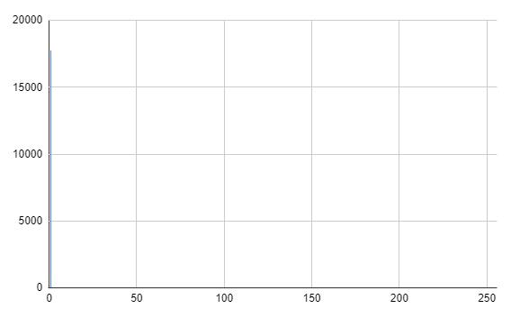
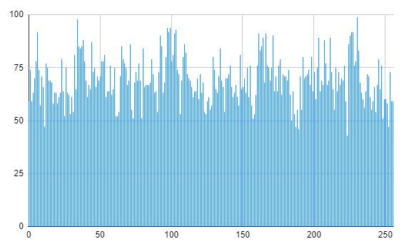
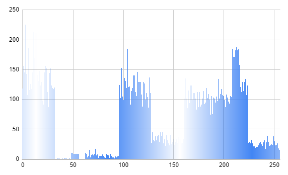
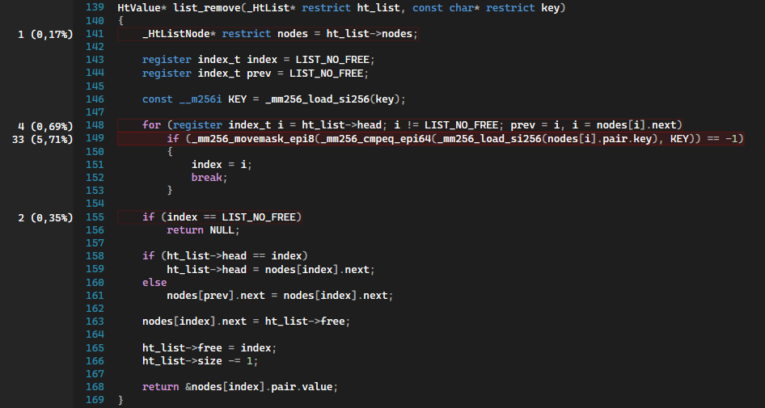
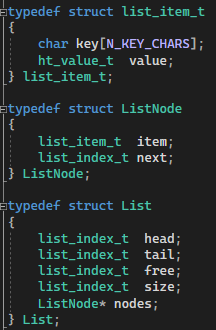
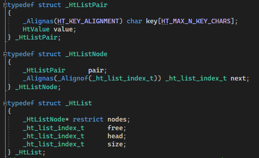

<pre>
 ___  ___  ________  ________  ___  ___  _________  ________  ________  ___       _______      
|\  \|\  \|\   __  \|\   ____\|\  \|\  \|\___   ___\\   __  \|\   __  \|\  \     |\  ___ \     
\ \  \\\  \ \  \|\  \ \  \___|\ \  \\\  \|___ \  \_\ \  \|\  \ \  \|\ /\ \  \    \ \   __/|    
 \ \   __  \ \   __  \ \_____  \ \   __  \   \ \  \ \ \   __  \ \   __  \ \  \    \ \  \_|/__  
  \ \  \ \  \ \  \ \  \|____|\  \ \  \ \  \   \ \  \ \ \  \ \  \ \  \|\  \ \  \____\ \  \_|\ \ 
   \ \__\ \__\ \__\ \__\____\_\  \ \__\ \__\   \ \__\ \ \__\ \__\ \_______\ \_______\ \_______\
    \|__|\|__|\|__|\|__|\_________\|__|\|__|    \|__|  \|__|\|__|\|_______|\|_______|\|_______|
                       \|_________|                                                            
                                                                                               
                                                                                               
</pre>

# HT - Hashtable library
## Description
A powerful hashtable library with the logging system and the errors handler. <br>
The library provides a hashtable data structure and the safe API to work with it.
> For better performance **the library uses AVX2 instructions**, so your CPU must support them. <br> 

## Features
* The handler for error processing
* 3 hashtable modes for different data amount
* The logging system for tracking API functions calls
> The logging system is not provided, if you are using MSVC.

## Installation

* Clone the repository:

  `git clone https://github.com/NikitaDzer/Hashtable.git`
* Compile the HT library:

  ```shell
  cd Hashtable
  mkdir build
  cd build
  cmake ..
  make
  ```


## Usage
Include the hashtable library and construct a new hashtable.

```c 
HtHashtable *ht_hashtable = construct_hashtable();
```
The library provides 3 functions to operate with data in a hashtable: **insert, remove, search**. <br>
Code sample:

```c
const char bro_key[HT_MAX_N_KEY_CHARS] = "bro"; // 32-byte key buffer
HtValue *bro = NULL;

hashtable_insert(ht_hashtable, bro_key, &(HtValue){ .nickname = "Roflan" }); // inserts the value to the hashtable
bro = hashtable_search(ht_hashtable, transform_key("bro"));                  // searches for a value with the passed key

if (control_hashtable() == HT_BAD_KEY) // checks if the key is not found
    printf("No bro in hashtable...\n");
else
{
    printf("My bro's nickname is %s\n.", bro->nickname);
    hashtable_remove(ht_hashtable, transform_key("bro")); // removes the key "bro" from the hashtable
}
```
> Hashtable **keys must be in 32-byte buffers with null-terminal chars after the content part** of keys. For example: <br>
> ```bro_key[HT_MAX_N_KEY_CHARS] = "bro"```
or <br>
```bro_key[32] = ['b','r','o','\0','\0'...'\0']```, where **32 - 3 = 29** null-terminal chars. <br> 
So if you don't provide 32-byte keys, you should use the wrapper ```const char* transform_key(const char *key)```, which is defined in the library.
For better performance we recommend using your own 32-bytes keys, than calling **transform_key**.

The function ```HtResult control_hashtable(void)``` is used to get a report about the latest call of the next hashtable functions: **construct, destruct, insert, remove, search**. 
In our case we check if such a key exists at all. As a result, the program should print **"My bro's nickname is Roflan."** .

After using a hashtable, you need to clear it with the destructor.

```c
destruct_hashtable(ht_hashtable);
```

***
## Less collisions, more performance
The hash function is one of the bottlenecks in our HT library. It has to be fast and to have the most uniform collisions for faster searching in lists.
 <br>

We will see hash functions code and their graphs, where along the X-axis is the _(hashtable's)_ list number and along the Y-axis is its length. <br><br>

#### 1. Returns always 1.
```c
unsigned char hash_1(const char *key)
{
    return 1;
}
```
 <br>
As we see, just one list has all **17000** elements. <br><br>

#### 2. Returns ASCII-code of the first letter.
```c
unsigned char hash_letter(const char *key)
{
    return key[0];
}
```
 <br>
The largest list size is over **1800** elements. At least, it's not **17000** elements as with **hash1**. <br><br>

#### 3. Returns key length.
```c
unsigned char hash_len(const char *key)
{
    return strlen(key);
}
```
 <br>
The graph is similar to the Poisson distribution... or the Burj Khalifa. <br> <br>

#### 4. Returns sum of ASCII-codes.
```c
unsigned char hash_sum(const char *key)
{
    unsigned char hash = 0;
    const size_t len = strlen(key);
    
    for (size_t i = 0; i < len; i++)
        hash += key[i];
    
    return hash;
}
```
 <br>
This hash function is much better! But there is a pronounced peak over 160-th list. <br> <br>

#### 5. Ded32 hash function.
```c
unsigned char hash_ded32(const char *key)
{
    hash_t hash = key[0];
    size_t len  = strlen(key);

    for (size_t i = 1; i < len; i++)
        hash = ((hash >> 1) | (hash << (sizeof(unsigned char) * CHAR_BIT - 1))) ^ key[i]; 
                            /* hash << 7 */
    return hash;
}
```
 <br>
Excellent! For its speed, the hash function turned out to be quite good for our purpose. <br> <br>


#### 6. Nikita Dzer quick hash function.
```c
unsigned char hash_dzer(const char *key)
{
    const char *const  lastByte = key + strlen(key);
    unsigned char      hash     = 0xDED007;
   
    while (key < lastByte)
        hash = ((hash << 0x8) + (hash >> 0x8)) ^ *key++;
   
    return hash;
}
```
 <br>
The quick hash has 3 bad areas that make the function unpromising.

### Hash functions. Conclusion
It's easy to see that the best hash function in the uniformity of collisions is **hash_ded32**. Congratulations to the winner! 
## Necks of the bottles
What about HT library bottlenecks? We will try to understand it with Visual Studio 2019 Profiler. <br>
The program **selects all words** from 4 books about Harry Potter, **constructs** the hashtable, **inserts** the words as keys and some values to it, then **searches** values by keys, **removes** all keys and **destructs** the hashtable. <br>
Let's take a look on the result.
> The program was compiled with the debug mode in MSVC.


The functions are sorted in **descending order of spent exclusive time**. <br>
There are three bottlenecks: **list_find_item_address** _(renamed to **list_find_value**)_, **list_extract** _(renamed to **list_remove**)_ and **strncmp**. <br>
How can they be eliminated? We can fix them in two ways: by using **AVX2 instructions** and by making a hashtable **more cache-friendly**. 

### AVX2 instructions
The fastest alternative of **strncmp** is **_mm256_cmpeq_epi64** (with **_mm256_movemask_epi8**), but it requires data to be in YMM registers. To load data from memory to the registers we use **_mm256_load_si256**. Storing key to a hashtable can be done with the intrinsic **_mm256_store_si256**. 

The results of the optimizations are presented in the tables (the performance boost relative to the _unoptimized_ and _previous_ versions). 
#### strncmp. The optimization results 
|  Unoptimized  |  Previous  |
|:-------------:|:----------:|
|    +32.0%     |   +32.0%   |
<br>

#### list_find_item_address. Before

#### list_find_value. After

#### list_find_value. The optimization results
|  Unoptimized  |  Previous  |
|:-------------:|:----------:|
|    +29.5%     |   +44.8%   |
<br>

#### list_extract. Before

#### list_remove. After

#### list_remove. The optimization results
|  Unoptimized  |  Previous  |
|:-------------:|:----------:|
|     +8.7%     |   +23.4%   |

Since the last optimization increased performance _(relative to the unoptimized version)_ by less than 10%, we stop here.


### Cache is our friend
If we want to get any data, we don't want it to cross cache-lines. Since in most x64 architectures a cache-line holds 64 bytes of data, we need to **reduce the size of a list structure (from 40 to 32 bytes) and a list's key-value pair structure** and **align them on a 32-byte boundary**. 
> So, **if there is a cache-miss** when accessing a list structure or a list's key, then **there will be only one cache-miss instead of two possible**.

#### List structures. Before


#### List structures. After



### Bottlenecks elimination
> The program was compiled with the debug mode in MSVC.


Amazing results! <br> **strncmp** is no longer in the top of the most resource-intensive functions _(because it doesn't exist in program at all)_. <br>
**list_find_value** is optimized as much as possible, and it's no longer a bottleneck. 

_**__CheckForDebugger** is the VS19 debugger function; **get_keys**, **free_keys** and etc. are HT library private functions_.


### What about a real performance boost?
> The program was compiled with the release mode in MSVC.

Before optimizations: **~273ms**. <br>
After  optimizations: **~141ms**. <br>
Performance boost: **~+93%**. 

 Unfortunately, it's hard to say, how cache optimizations influenced on the final result. But aligning everything is definitely not good: **data becomes less spatially local**, especially, if there is a lot of data.

### And the last. Was it worth all that days?
The efficiency: **E = (1.93 / 10) * 1000 = 193**. <br>
But it's only an approximate number. And, of course, **it was worth all wasted days to f@ck that sh1t**.


***
## Who? 
HT library is written by [Nikita Dzer](https://vk.com/id188977770). <br>
♥ WITH LOVE
